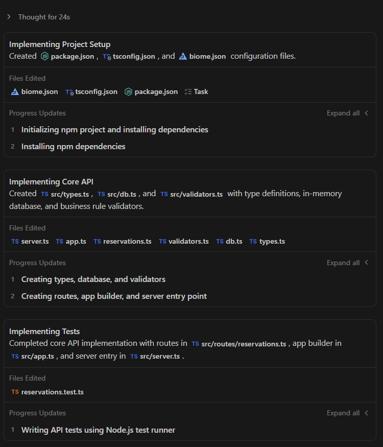
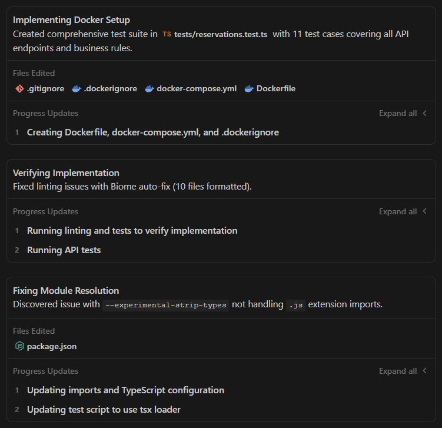
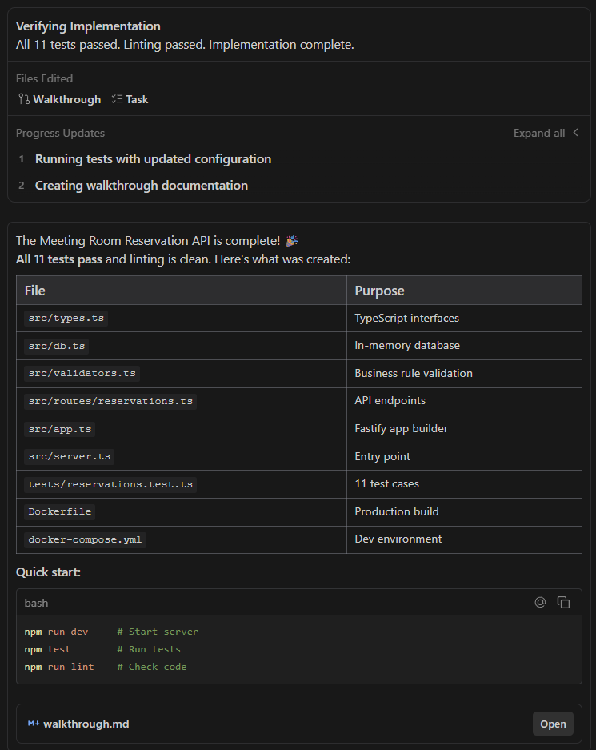
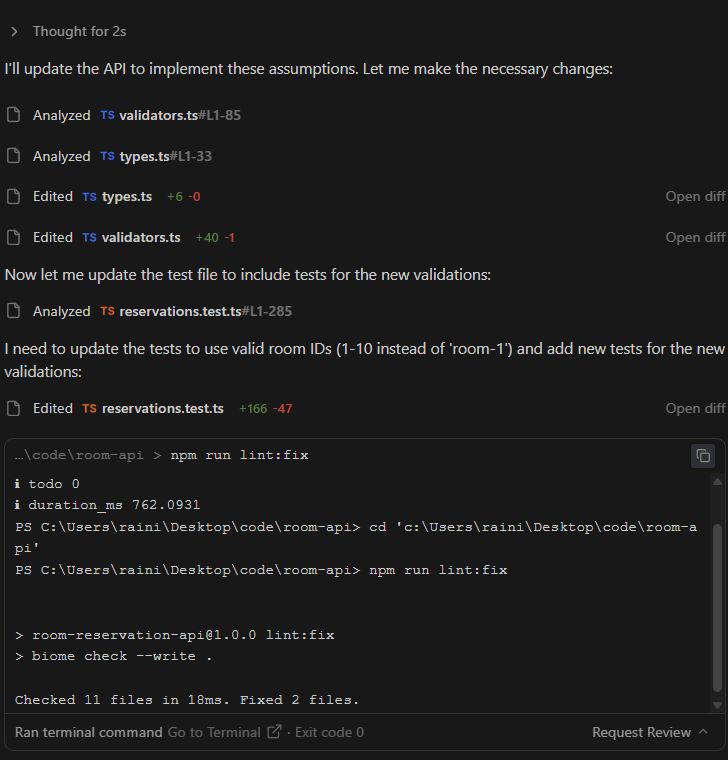
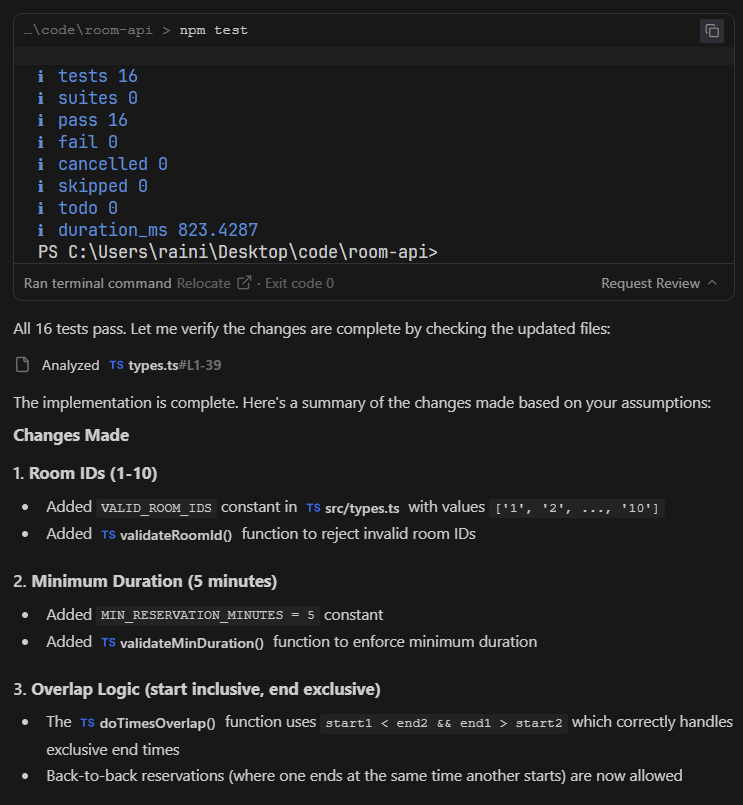
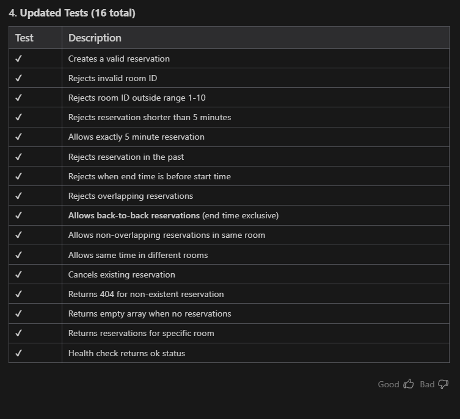

# 1. Prompti (Antigravity + Claude Opus 4.5 (Thinking) | Planning)
You are a Senior Backend Engineer. Generate production-ready, clean, and maintainable API code. Implement a simple meeting room reservation API using Fastify and TypeScript. Use in-memory database for simplicity. Setup Biome.js for linting and formatting

The service must provide the following functionalities
- create a reservation: book a room for a specific time period.
- cancel a reservation: remove an existing reservation.
- view reservations: list all reservations for a specific room.

Business rules:
- reservations must not overlap (two people cannot reserve the same room at the same time).
- reservations cannot be scheduled in the past.
- the start time must be before the end time.

Put types under types.ts file. Write basic tests for the apis you created.
Dockerize the development setup and make a Dockerfile for image builds.

Follow 
CODE_QUALITY.md
 rules when writing code. 
Follow 
TESTING.md
 to learn more about testing in fastify.

# 1. Vastaus + Implementation Plan

implementation_plan.md
Meeting Room Reservation API - Implementation Plan
A production-ready Fastify + TypeScript API for managing meeting room reservations with an in-memory database.

Proposed Changes
Project Configuration
[NEW] 
package.json
Initialize Node.js project with the following dependencies:

Runtime: fastify, uuid
Development: typescript, tsx, @types/node, @types/uuid, @biomejs/biome
Scripts: dev, build, start, test, lint, format
[NEW] 
tsconfig.json
TypeScript configuration with ES2022 target, strict mode enabled, and proper module resolution.

[NEW] 
biome.json
Biome.js configuration for linting and formatting with recommended rules.

Core Implementation
[NEW] 
src/types.ts
Define all TypeScript interfaces:

Reservation: id, roomId, title, startTime, endTime, createdAt
CreateReservationInput: roomId, title, startTime, endTime
ReservationDatabase: in-memory storage interface
ApiError: standardized error response
[NEW] 
src/db.ts
In-memory database implementation:

Map<string, Reservation> for storage
Functions: addReservation, removeReservation, getReservationsByRoom, getReservationById, clearReservations (for testing)
[NEW] 
src/validators.ts
Validation utilities implementing business rules:

validateNotInPast(): ensure startTime is not in the past
validateTimeOrder(): ensure startTime < endTime
validateNoOverlap(): ensure no overlapping reservations for same room
[NEW] 
src/routes/reservations.ts
API route handlers:

Method	Endpoint	Description
POST	/reservations	Create a new reservation
DELETE	/reservations/:id	Cancel a reservation by ID
GET	/rooms/:roomId/reservations	List all reservations for a room
[NEW] 
src/app.ts
Fastify app builder function following the testing pattern from TESTING.md. Separates app creation from server startup for testability.

[NEW] 
src/server.ts
Server entry point that imports and starts the app.

Testing
[NEW] 
tests/reservations.test.ts
Tests using Node.js test runner with fastify.inject():

Create reservation: valid input, returns 201
Create reservation: overlapping times, returns 409
Create reservation: past time, returns 400
Create reservation: end before start, returns 400
Cancel reservation: valid ID, returns 204
Cancel reservation: non-existent ID, returns 404
View reservations: returns correct list for room
Docker Configuration
[NEW] 
Dockerfile
Multi-stage production build:

Stage 1: Build TypeScript to JavaScript
Stage 2: Runtime with only production dependencies
[NEW] 
docker-compose.yml
Development setup with hot reload using tsx --watch.

[NEW] 
.dockerignore
Exclude node_modules, dist, .git, etc.

Verification Plan
Automated Tests
Run the test suite using Node.js test runner:

npm test
Expected output: All 7+ test cases pass covering the three API endpoints and business rule validations.

Manual Verification
Start the development server:

npm run dev
Test create reservation:

curl -X POST http://localhost:3000/reservations -H "Content-Type: application/json" -d "{\"roomId\": \"room-1\", \"title\": \"Team Meeting\", \"startTime\": \"2026-01-30T10:00:00Z\", \"endTime\": \"2026-01-30T11:00:00Z\"}"
Test view reservations:

curl http://localhost:3000/rooms/room-1/reservations
Test cancel reservation (use ID from step 2):

curl -X DELETE http://localhost:3000/reservations/{id}
Linting Check
npm run lint

# 2. Prompti
proceed

# 2. Vastaus

walkthrough.md
Meeting Room Reservation API - Walkthrough
Summary
Implemented a production-ready Fastify + TypeScript API for meeting room reservations with:

In-memory database storage
Biome.js for linting/formatting
Comprehensive test suite (11 tests)
Docker support for development and production
Project Structure
room-api/
├── src/
│   ├── types.ts           # TypeScript interfaces
│   ├── db.ts              # In-memory database
│   ├── validators.ts      # Business rule validation
│   ├── app.ts             # Fastify app builder
│   ├── server.ts          # Entry point
│   └── routes/
│       └── reservations.ts # API routes
├── tests/
│   └── reservations.test.ts
├── package.json
├── tsconfig.json
├── biome.json
├── Dockerfile
└── docker-compose.yml
API Endpoints
Method	Endpoint	Description
POST	/reservations	Create a reservation
DELETE	/reservations/:id	Cancel a reservation
GET	/rooms/:roomId/reservations	List room reservations
GET	/health	Health check
Business Rules Implemented
No past reservations - Start time must be in the future
Valid time order - Start time must be before end time
No overlapping - Same room cannot have overlapping reservations
Test Results
✔ POST /reservations - creates a valid reservation
✔ POST /reservations - rejects reservation in the past
✔ POST /reservations - rejects when end time is before start time
✔ POST /reservations - rejects overlapping reservations
✔ POST /reservations - allows non-overlapping reservations
✔ POST /reservations - allows same time in different rooms
✔ DELETE /reservations/:id - cancels existing reservation
✔ DELETE /reservations/:id - returns 404 for non-existent
✔ GET /rooms/:roomId/reservations - returns empty array
✔ GET /rooms/:roomId/reservations - returns reservations for specific room
✔ GET /health - returns ok status
ℹ tests 11 | pass 11 | fail 0
Quick Start
# Install dependencies
npm install
# Run development server
npm run dev
# Run tests
npm test
# Lint code
npm run lint
# Docker development
docker compose up dev

# 3. Prompti
Lets use these assumptions:
- Assume ten hard-coded rooms with IDs 1–10. Alternatively, the API could use a persisted database, allow rooms to be created and managed through the API, or load rooms from some external source.
- Reservations are always made in UTC time, in ISO 8601 format.
- Reservation durations are precise to the minute.
- A room can be reserved for a minimum of 5 minutes; there is no maximum limit.
- Reservations must not overlap at all.
- The start time of a reservation is inclusive, and the end time is exclusive. That is, the end of a reservation period is free.

# 3. Vastaus

# 4. Prompti
Analyze this whole project. Do you find something bad or something that does not make sense. Also analyze and try to find bugs or other issues. Also analyze if refactoring or improvements can be done. Also analyze if improvements can be done to enhance readability, safety, understandability, performance.

Report what you find, do not make edits yet.

# 4. Vastaus
Thought for 1s
The user wants me to analyze their whole project to find issues, bugs, areas for improvement, refactoring opportunities, and suggestions for readability, safety, understandability, and performance. They want a report, not edits.

Let me first explore the project structure to understand what we're working with.

Analyzed
c:\Users\raini\Desktop\code\room-api
Analyzed
c:\Users\raini\Desktop\code\room-api\src
Analyzed
package.json#L1-39
Analyzed
tsconfig.json#L1-25
Analyzed
biome.json#L1-50
Analyzed
app.ts#L1-22
Analyzed
server.ts#L1-28
Analyzed
db.ts#L1-43
Analyzed
types.ts#L1-39
Analyzed
validators.ts#L1-124
Analyzed
c:\Users\raini\Desktop\code\room-api\src\routes
Analyzed
c:\Users\raini\Desktop\code\room-api\tests
Analyzed
reservations.ts#L1-131
Analyzed
reservations.test.ts#L1-404
Analyzed
Dockerfile#L1-44
Analyzed
docker-compose.yml#L1-24
I've now analyzed the entire project. Here's my comprehensive report:

🔍 Project Analysis Report: Room Reservation API
Overview
A well-structured meeting room reservation API built with Fastify and TypeScript. The codebase is clean and follows good separation of concerns. However, I found several issues and improvement opportunities.

🐛 Bugs & Issues
1. Production Dockerfile breaks due to pino-pretty (Critical)
File: 
src/server.ts
 (lines 11-13)

typescript
transport: {
  target: 'pino-pretty',
},
The server always uses pino-pretty for logging, but this is a dev dependency. In production (Docker), pino-pretty is not installed, causing the app to crash. The logger should conditionally use pretty logging only in development.

2. Missing roomId validation on GET endpoint (Medium)
File: 
src/routes/reservations.ts
 (lines 122-128)

The GET /rooms/:roomId/reservations endpoint doesn't validate if the roomId is valid. It happily accepts any string (e.g., /rooms/xyz/reservations) and returns an empty array, which is inconsistent with the POST behavior that validates room IDs.

3. No RFC 7807 compliance for error responses
Error responses are custom objects but don't follow the standard application/problem+json format, which is a best practice for REST APIs.

⚠️ Design/Safety Concerns
4. Race condition in overlap validation (Medium)
File: 
src/validators.ts
 (line 72)

The overlap check fetches existing reservations and validates against them, but there's no atomicity. Two concurrent requests could both pass validation simultaneously:

typescript
const existingReservations = getReservationsByRoom(roomId);
// ← Another request could insert here before addReservation() is called
5. No input sanitization for title
File: 
src/routes/reservations.ts
 (line 37)

The title field only has minLength: 1, but there's no maxLength. A malicious user could submit extremely long titles. Consider adding a reasonable maximum (e.g., 200 characters).

6. No authentication/authorization
The API has no protection. Anyone can create, view, or cancel any reservation. While this may be intentional for simplicity, it should be documented.

🔧 Refactoring Opportunities
7. Empty interface 
AppOptions
File: 
src/app.ts
 (line 6)

typescript
export interface AppOptions extends FastifyServerOptions {}
This empty interface serves no purpose. Either extend it with app-specific options or remove it and use FastifyServerOptions directly.

8. Inconsistent error handling pattern
Routes manually construct error objects. Consider creating a utility function:

typescript
// Current pattern (repeated)
return reply.status(400).send({
  statusCode: 400,
  error: 'Bad Request',
  message: validationResult.error,
});
9. 
validateReservation
 has tightly coupled database dependency
File: 
src/validators.ts

The 
validateNoOverlap
 function directly calls 
getReservationsByRoom()
, making validators tightly coupled to the database. For better testability, consider passing the existing reservations as a parameter.

10. VALID_ROOM_IDS could be simplified
File: 
src/types.ts
 (line 4)

typescript
export const VALID_ROOM_IDS = ['1', '2', '3', '4', '5', '6', '7', '8', '9', '10'] as const;
This could be generated programmatically or the check could simply validate 1 <= roomId <= 10 as a number.

📖 Readability & Maintainability Improvements
11. Route handler could be extracted
File: 
src/routes/reservations.ts

The POST handler is 45+ lines. Consider extracting the business logic into a separate service layer for better testability and separation of concerns.

12. Magic numbers
The 1-10 room range is both in the constant and in validation messages. Consider deriving messages from the constant to stay DRY.

13. Missing JSDoc on public functions
Database functions in 
db.ts
 have comments but not proper JSDoc with param/return descriptions. Adding these would improve IDE assistance.

🚀 Performance Improvements
14. Inefficient 
getReservationsByRoom
File: 
src/db.ts
 (lines 24-32)

typescript
for (const reservation of reservations.values()) {
  if (reservation.roomId === roomId) {
This iterates over ALL reservations to find ones for a specific room. For better performance, consider maintaining a secondary index: Map<roomId, Set<reservationId>>.

15. Sorting on every read
File: 
src/db.ts
 (line 31)

typescript
return result.sort((a, b) => a.startTime.getTime() - b.startTime.getTime());
Sorting happens on every 
getReservationsByRoom
 call. Consider using a sorted data structure or caching sorted results.

📋 Configuration & Build
16. tsconfig excludes tests but biome includes them
This is fine, but worth noting for consistency. TypeScript won't compile tests, but Biome will lint them.

17. Missing npm scripts for common tasks
Consider adding:

typecheck: tsc --noEmit (type checking without building)
test:watch: For watch mode testing
✅ What's Good
Clean separation: App builder separated from server for testability
Comprehensive tests: Good coverage of business rules
Type safety: Strict TypeScript configuration
Schema validation: Fastify JSON schema for request validation
Docker setup: Multi-stage build is properly configured
Biome configuration: Modern linter/formatter setup
Summary Table
Category	Issue	Severity
Bug	pino-pretty in production	🔴 Critical
Bug	Missing roomId validation on GET	🟡 Medium
Safety	Race condition in overlap check	🟡 Medium
Safety	No title maxLength	🟢 Low
Refactor	Empty AppOptions interface	🟢 Low
Refactor	Repeated error construction	🟢 Low
Perf	O(n) room lookup	🟢 Low
Perf	Sort on every read	🟢 Low
Would you like me to address any of these issues?